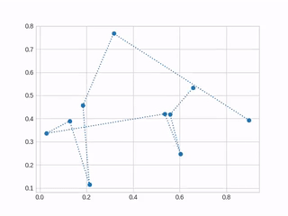

======================================================
Distributed Delayed Stochastic Constraint Optimization
======================================================

|license|

.. |license| image:: https://img.shields.io/github/license/stheid/DDSCO
    :target: LICENSE

This code provides experimental results and a simple algorithm to solve distributed constrained optimization tasks.
The experiment implemented here will simulate robot a robot swarm to arrange on a line or a circle.

|line|

Overview
--------
- :code:`scripts` contain usage files
- :code:`ddsco` contains the implementation
- :code:`results` contains experimental results

Installation
------------
**Disclaimer**: The code probably doesn't run without modifications on Windows.
It should work on any standard Linux distribution.

Simple
^^^^^^
* Install Python package::

  $ pip install .

